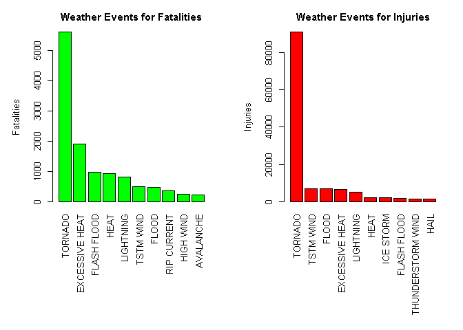

# Reproducible Research: Peer Assessment 2


## The basic objective of this assignment is to explore the NOAA Storm Database and answer some basic questions about severe weather events. We must use the database to answer the questions below and show the code for your entire analysis. 

### Synopsis: Storms and other severe weather events can cause both public health and economic problems for communities and municipalities. Many severe events can result in fatalities, injuries, and property damage, and preventing such outcomes to the extent possible is a key concern. This project involves exploring the U.S. National Oceanic and Atmospheric Administration's (NOAA) storm database. This database tracks characteristics of major storms and weather events in the United States, including when and where they occur, as well as estimates of any fatalities, injuries, and property damage. 

### Data Processing
 

```r
repdata <- read.csv("repdata-data-StormData.csv")
head(repdata)
```

```
##   STATE__           BGN_DATE BGN_TIME TIME_ZONE COUNTY COUNTYNAME STATE
## 1       1  4/18/1950 0:00:00     0130       CST     97     MOBILE    AL
## 2       1  4/18/1950 0:00:00     0145       CST      3    BALDWIN    AL
## 3       1  2/20/1951 0:00:00     1600       CST     57    FAYETTE    AL
## 4       1   6/8/1951 0:00:00     0900       CST     89    MADISON    AL
## 5       1 11/15/1951 0:00:00     1500       CST     43    CULLMAN    AL
## 6       1 11/15/1951 0:00:00     2000       CST     77 LAUDERDALE    AL
##    EVTYPE BGN_RANGE BGN_AZI BGN_LOCATI END_DATE END_TIME COUNTY_END
## 1 TORNADO         0                                               0
## 2 TORNADO         0                                               0
## 3 TORNADO         0                                               0
## 4 TORNADO         0                                               0
## 5 TORNADO         0                                               0
## 6 TORNADO         0                                               0
##   COUNTYENDN END_RANGE END_AZI END_LOCATI LENGTH WIDTH F MAG FATALITIES
## 1         NA         0                      14.0   100 3   0          0
## 2         NA         0                       2.0   150 2   0          0
## 3         NA         0                       0.1   123 2   0          0
## 4         NA         0                       0.0   100 2   0          0
## 5         NA         0                       0.0   150 2   0          0
## 6         NA         0                       1.5   177 2   0          0
##   INJURIES PROPDMG PROPDMGEXP CROPDMG CROPDMGEXP WFO STATEOFFIC ZONENAMES
## 1       15    25.0          K       0                                    
## 2        0     2.5          K       0                                    
## 3        2    25.0          K       0                                    
## 4        2     2.5          K       0                                    
## 5        2     2.5          K       0                                    
## 6        6     2.5          K       0                                    
##   LATITUDE LONGITUDE LATITUDE_E LONGITUDE_ REMARKS REFNUM
## 1     3040      8812       3051       8806              1
## 2     3042      8755          0          0              2
## 3     3340      8742          0          0              3
## 4     3458      8626          0          0              4
## 5     3412      8642          0          0              5
## 6     3450      8748          0          0              6
```
 
### subset the data to health and economic impact analysis against weather

```r
relevantcols <- c("EVTYPE", "FATALITIES", "INJURIES", "PROPDMG", "PROPDMGEXP", "CROPDMG", "CROPDMGEXP")
stormdata <- repdata[relevantcols]
```

### Explore the data - Property damage data and crop damage data


```r
unique(stormdata$PROPDMGEXP)
```

```
##  [1] K M   B m + 0 5 6 ? 4 2 3 h 7 H - 1 8
## Levels:  - ? + 0 1 2 3 4 5 6 7 8 B h H K m M
```

```r
unique(stormdata$CROPDMGEXP)
```

```
## [1]   M K m B ? 0 k 2
## Levels:  ? 0 2 B k K m M
```

#### Property Damage


```r
stormdata$PROPDMGEXP <- as.character(stormdata$PROPDMGEXP)
stormdata$PROPDMGEXP[toupper(stormdata$PROPDMGEXP) == 'H'] <- "2"
stormdata$PROPDMGEXP[toupper(stormdata$PROPDMGEXP) == 'K'] <- "3"
stormdata$PROPDMGEXP[toupper(stormdata$PROPDMGEXP) == 'M'] <- "6"
stormdata$PROPDMGEXP[toupper(stormdata$PROPDMGEXP) == 'B'] <- "9"
stormdata$PROPDMGEXP <- as.numeric(stormdata$PROPDMGEXP)
```

```
## Warning: NAs introduced by coercion
```

```r
stormdata$PROPDMGEXP[is.na(stormdata$PROPDMGEXP)] <- 0
stormdata$TOTALPROPDMG <- stormdata$PROPDMG * 10^stormdata$PROPDMGEXP
```
#### Crop Damage


```r
stormdata$CROPDMGEXP <- as.character(stormdata$CROPDMGEXP)
stormdata$CROPDMGEXP[toupper(stormdata$CROPDMGEXP) == 'H'] <- "2"
stormdata$CROPDMGEXP[toupper(stormdata$CROPDMGEXP) == 'K'] <- "3"
stormdata$CROPDMGEXP[toupper(stormdata$CROPDMGEXP) == 'M'] <- "6"
stormdata$CROPDMGEXP[toupper(stormdata$CROPDMGEXP) == 'B'] <- "9"
stormdata$CROPDMGEXP <- as.numeric(stormdata$CROPDMGEXP)
```

```
## Warning: NAs introduced by coercion
```

```r
stormdata$CROPDMGEXP[is.na(stormdata$CROPDMGEXP)] <- 0
stormdata$TOTALCROPDMG <- stormdata$CROPDMG * 10^stormdata$CROPDMGEXP
```
#### Fatalities and Injuries
 

```r
fatalities <- aggregate(stormdata$FATALITIES, by = list(stormdata$EVTYPE), "sum")
names(fatalities) <- c("Event", "Fatalities")
fatalities <- fatalities[order(-fatalities$Fatalities), ][1:10, ]
##fatalities
 
injuries <- aggregate(stormdata$INJURIES, by = list(stormdata$EVTYPE), "sum")
names(injuries) <- c("Event", "Injuries")
injuries <- injuries[order(-injuries$Injuries), ][1:10, ]
##suminjuries
```
### Results of Analysis


```r
par(mfrow = c(1, 2), mar = c(12, 5, 3, 2), mgp = c(3, 1, 0), cex = 0.8, las = 3)
barplot(fatalities$Fatalities, names.arg = fatalities$Event, col = 'green',
        main = 'Weather Events for Fatalities', ylab = 'Fatalities')
barplot(injuries$Injuries, names.arg = injuries$Event, col = 'red',
        main = 'Weather Events for Injuries', ylab = 'Injuries')
```

 
